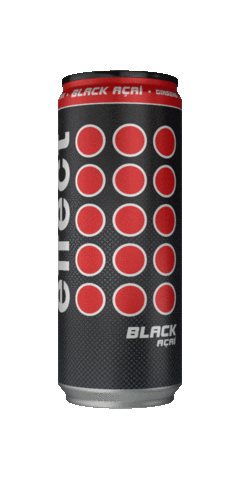
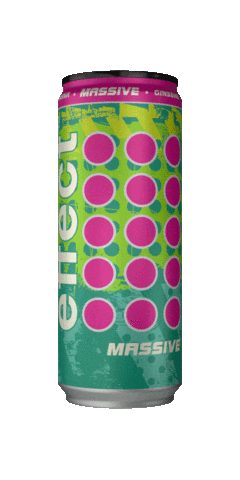
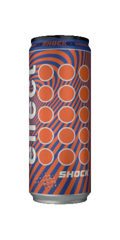
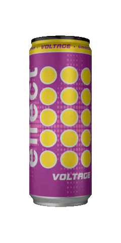
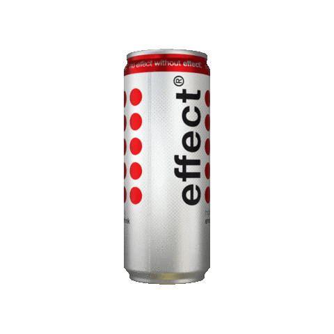

<!-- 

	
	
	
	

How to <del>en</del>reach me:  
	<a target="_blank" href="https://adkasyv.github.io/portolio_site/">website</a> and  <a href="mailto:kasymbekov01384@gmail.com">email</a>

-->

<!-- 
 	 
-->

 
<!-- 
 -->
  <!--  -->
  <!--  -->
  <!--  -->
<!-- 
 -->

<!--  -->
<!-- 

  
  
  
  
  
  

 -->

<!-- 

 -->

<!-- 

  
  
  

 -->

<!-- Says he **loves** generation \\\ Z //... **doesn't say!** otherwise -->

<!--
**adkasyv/adkasyv** is a ✨ _special_ ✨ repository because its `README.md` (this file) appears on your GitHub profile.

Here are some ideas to get you started:

- 🔭 I’m currently working on ...
- 🌱 I’m currently learning ...
- 👯 I’m looking to collaborate on ...
- 🤔 I’m looking for help with ...
- 💬 Ask me about ...
- 📫 How to reach me: ...
- 😄 Pronouns: ...
- ⚡ Fun fact: ...
-->

# Hi, I'm Adil 👋
Junior Frontend Developer with more than 1 years. I have excellent knowledge in backend development on React/JS. Big part of my acitities is open-source.

   
   

   
   

   📫 How to reach me: <a href='mailto:kasymbekov01384@gmail.com'>kasymbekov01384@gmail.com</a>

## 🛠 Technical Stack
*   Javascript(ES6),HTML5,CSS3,SCSS,Bootstrap.
*   Typescript, Node.js, React, JSX, React router-dom (v5|v6), Redux (Thunk and toolkit).
*   Tailwind, Material Ui, ChakraUi, Swagger, MVC, API, JSON, SEO, UX/UI.
*   GitHub/GitLab/Gerrit/Bitbucket.

### My opensource projects

*   [my-site](https://adkasyv.github.io/portolio_site)

   

