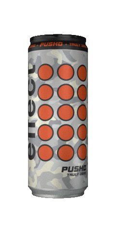
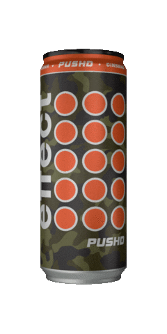

	
	
	

How to <del>en</del>reach me:  
	<a href="https://gzmland.ru/">website</a> and  <a href="https://gzmland.ru/">email</a>

 
<!-- 
 -->
  <!--  -->
  <!--  -->
  <!--  -->
<!-- 
 -->

<!--  -->
<!-- 

  
  
  
  
  
  

 -->

<!-- 

 -->

<!-- 

  
  
  

 -->

<!-- Says he **loves** generation \\\ Z //... **doesn't say!** otherwise -->

<!--
**adkasyv/adkasyv** is a ✨ _special_ ✨ repository because its `README.md` (this file) appears on your GitHub profile.

Here are some ideas to get you started:

- 🔭 I’m currently working on ...
- 🌱 I’m currently learning ...
- 👯 I’m looking to collaborate on ...
- 🤔 I’m looking for help with ...
- 💬 Ask me about ...
- 📫 How to reach me: ...
- 😄 Pronouns: ...
- ⚡ Fun fact: ...
-->
